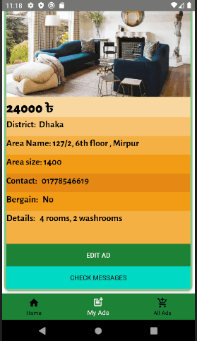

### Neer
Project made by me for Software Development III course. 
2nd Year, 2nd Semester

## Project Description

The project is based on digital house rent advertisement. The main focus
of our project is to provide easy and interactive environment for those
who are searching for a better residential space. By using this application
user can create his own account, upload information about his residential
facilities for rent by adding images and details.And for the people who are
searching for better residential facilities can easily find their desired place
and contact with the owner.

## Software Specifications

Android Minimum Version: API 19(or Android 4.4-kitkat) 
Android Maximum Version: API 30(or Android 10.0+-R) 
Database: Firebase

## Project Features

1. User: 
(a) User has to create an account and then login. 
(b) User can update their own profile by adding personal information and uploading photos. 
(c) Users can add, edit and delete the advertisement of their choice.

2. Advertisement: 
(a) Users can add any type of information of the residence including
images which will have two interfaces : Public ad interface,
Private ad interface. 
(b) Public ad interface : This section is visible for all users. 
(c) Private ad interface : This section is only visible for the account
owner.

3. Live Chat: 
(a) Using public ad interface anyone can send message to the owner
of an advertisement. 
(b) Using private ad interface advertisement owner can see all the
messages sent from various user for an specific advertisement. 
(c) User and owner both can see last online status of each other.

4. Query: 
(a) User can see advertisement according to their desired search
filter. 

Video Link: https://youtu.be/kt32FWxfvVc
